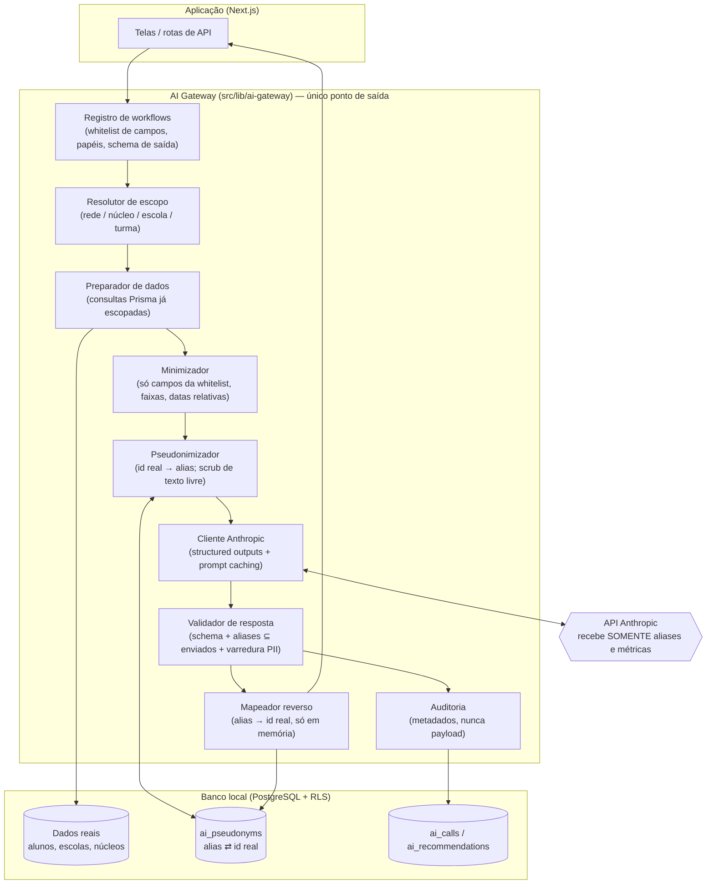

# Arquitetura de IA com Privacidade — Vela em Escala de Rede

> Especificação para operar os recursos de IA da plataforma em milhares de escolas,
> núcleos regionais e redes de ensino, garantindo que **nenhum dado pessoal
> identificável saia do banco local**. Todos os exemplos usam a stack real do
> projeto: Next.js 14, Prisma, PostgreSQL e `@anthropic-ai/sdk` (TypeScript).

---

## 1. Arquitetura geral

Princípio central: **um único ponto de saída para a IA** (o *AI Gateway*). Nenhuma
rota de API chama a Anthropic diretamente — toda chamada passa pelo gateway, que
aplica, nesta ordem: autorização de escopo → whitelist de campos do workflow →
minimização → pseudonimização → chamada → validação → mapeamento reverso →
auditoria.



Propriedades garantidas por construção:

- A Anthropic **nunca** recebe nome, CPF, matrícula, contato, endereço, id interno
  real, nem nome real de escola/núcleo quando desnecessário.
- A tabela `ai_pseudonyms` existe **apenas** no banco local; a IA não tem acesso a ela.
- A IA **recomenda/classifica/resume/sinaliza**; toda ação fica pendente de decisão
  humana registrada (`ai_recommendations.status`).
- Logs guardam contagens, hashes e aliases — nunca valores pessoais.

## 2. Fluxo completo de dados, passo a passo

Exemplo: coordenadora pede "análise de risco da turma 6º A".

1. **Requisição** — `POST /api/ai/workflows/analise_risco_turma` com `{ turmaAlias? , turmaId }`.
   O middleware já garantiu sessão; a rota nunca confia em ids vindos do corpo sem re-checagem.
2. **Workflow** — o gateway carrega a definição `analise_risco_turma` do registro:
   papéis permitidos, whitelist de campos, schema Zod de saída, tier de modelo, limite de entidades.
3. **Autorização de escopo** — o resolutor deriva da **sessão** (nunca do corpo) o conjunto
   de escolas visível (rede inteira / escolas do núcleo / a própria escola / turmas do professor)
   e verifica que a turma pedida pertence a ele. Falha → 403 antes de tocar em qualquer dado.
4. **Preparação** — consultas Prisma escopadas trazem apenas os campos da whitelist
   (via `select`, nunca `include` aberto).
5. **Minimização** — transformações irreversíveis: data de nascimento → faixa etária;
   datas absolutas → "há N semanas"; grupos menores que `k` (padrão 5) são suprimidos
   das comparações; campos fora da whitelist são descartados mesmo que a consulta os traga.
6. **Pseudonimização** — cada entidade recebe/reutiliza seu alias (`aluno_8391`,
   `turma_6A_012`, `escola_042`, `nucleo_007`, `professor_015`) via `ai_pseudonyms`.
   Texto livre (ex.: título de registro pedagógico) passa pelo *scrubber*: CPFs,
   telefones, emails e nomes do roster local são substituídos por aliases ou `[REDIGIDO]`.
7. **Chamada** — payload pseudonimizado vai para a Anthropic com *structured outputs*
   (schema JSON estrito) e *prompt caching* no prefixo estável (instruções + rubrica).
8. **Validação** — a resposta é validada contra o schema Zod; todo alias citado precisa
   pertencer ao conjunto enviado (bloqueia alucinação de ids); campos de texto passam
   por varredura de padrões de PII (defesa em profundidade).
9. **Mapeamento reverso** — em memória, aliases viram ids reais; o resultado é gravado em
   `ai_recommendations` com `status: 'PENDENTE'` vinculado aos ids reais.
10. **Auditoria** — `ai_calls` registra: quem, qual workflow, escopo, aliases envolvidos,
    modelo, tokens, custo, duração, hash do payload. **Nunca o payload.**
11. **Decisão humana** — a UI mostra a recomendação; coordenação aceita/rejeita/adapta.
    `decided_by` + `decided_at` fecham o ciclo (art. 20 LGPD — revisão humana).

## 3. Modelo de pseudonimização

| Decisão | Escolha | Por quê |
|---|---|---|
| Geração do alias | **Aleatória com checagem de colisão** (`aluno_` + 4–6 dígitos) | Nunca derivado de dado real (hash de CPF é reidentificável por força bruta); não sequencial (sequência vaza ordem/volume de matrícula) |
| Estabilidade | **Estável por entidade** (1 alias por aluno) | Permite análise longitudinal ("aluno_8391 piorou desde o 1º bimestre") e cache |
| Rotação | Suportada (`rotated_at` + alias antigo inativado) | Direito de eliminação LGPD e resposta a incidente: rotacionar corta o vínculo com todo histórico externo |
| Reversibilidade | **Só pela tabela local** | Sem a tabela, o alias é ruído; a tabela nunca sai do banco |
| Quase-identificadores | Faixa etária, datas relativas, k-anonimato (k=5) em comparações | Um "aluno de 11 anos, turma X, transferido em 12/03" é identificável mesmo sem nome |
| Texto livre | Scrubber obrigatório ou exclusão | É o maior canal de vazamento — professores escrevem nomes no conteúdo |

Escala: com 4 dígitos, ~10 mil aliases por tipo; o gerador expande para 5–6 dígitos
automaticamente quando a densidade passa de 50%. Para redes com milhões de alunos,
o formato aceita `aluno_` + até 9 dígitos sem mudança de schema.

## 4. Tabelas locais (Prisma)

```prisma
// Hierarquia (adiciona núcleo e rede sobre o School.inepCode existente)
model EducationNetwork {          // Rede de ensino (ex.: SEDUC-PR)
  id      String  @id @default(cuid())
  name    String
  nuclei  RegionalNucleus[]
  @@map("education_networks")
}

model RegionalNucleus {           // Núcleo Regional de Educação
  id        String  @id @default(cuid())
  name      String
  code      String  @unique      // ex.: "NRE-CTBA-01"
  networkId String
  network   EducationNetwork @relation(fields: [networkId], references: [id])
  schools   School[]
  @@map("regional_nuclei")
}
// School ganha: nucleusId String? + relação (já tem inepCode)

// ─── Pseudonimização ─────────────────────────────────────────────
model AiPseudonym {
  id         String    @id @default(cuid())
  entityType String    // ALUNO | TURMA | ESCOLA | NUCLEO | PROFESSOR
  realId     String    // id interno real (cuid da entidade)
  alias      String    // "aluno_8391" — o ÚNICO identificador que sai
  active     Boolean   @default(true)
  createdAt  DateTime  @default(now())
  rotatedAt  DateTime?

  @@unique([entityType, realId, active])
  @@unique([alias])
  @@index([entityType, alias])
  @@map("ai_pseudonyms")
}

// ─── Governança de workflows ─────────────────────────────────────
model AiWorkflow {
  code          String   @id      // "analise_risco_aluno"
  purpose       String            // finalidade LGPD, em linguagem clara
  allowedRoles  String            // JSON: ["COORDENACAO","PEDAGOGO"]
  allowedFields String            // JSON: whitelist por entidade (fonte da verdade)
  outputSchema  String            // nome do schema Zod registrado no código
  modelTier     String   @default("claude-opus-4-8")
  maxEntities   Int      @default(200)
  kAnonymity    Int      @default(5)
  active        Boolean  @default(true)
  @@map("ai_workflows")
}

// ─── Auditoria (NUNCA payload, NUNCA PII) ────────────────────────
model AiCall {
  id            String   @id @default(cuid())
  workflowCode  String
  callerUserId  String            // operador (necessário p/ accountability)
  scopeType     String            // REDE | NUCLEO | ESCOLA | TURMA
  scopeAlias    String            // "escola_042" — nunca o nome
  model         String
  status        String            // OK | SCHEMA_INVALIDO | ALIAS_DESCONHECIDO | ERRO_API | RECUSADO
  inputTokens   Int
  outputTokens  Int
  costUsd       Float
  durationMs    Int
  requestHash   String            // sha256 do payload (prova de integridade sem conteúdo)
  responseHash  String
  entityCount   Int               // "83 alunos" — contagem, não lista de nomes
  createdAt     DateTime @default(now())
  entities      AiCallEntity[]
  @@index([workflowCode, createdAt])
  @@map("ai_calls")
}

model AiCallEntity {              // quais aliases participaram (para direito de acesso LGPD)
  id         String @id @default(cuid())
  callId     String
  entityType String
  alias      String               // alias, não id real — a junção só é possível localmente
  call       AiCall @relation(fields: [callId], references: [id], onDelete: Cascade)
  @@index([alias])
  @@map("ai_call_entities")
}

// ─── Decisão humana obrigatória ──────────────────────────────────
model AiRecommendation {
  id           String    @id @default(cuid())
  callId       String
  workflowCode String
  targetType   String              // ALUNO | TURMA | ESCOLA | NUCLEO
  targetId     String              // id REAL (já remapeado; só existe localmente)
  category     String              // RISCO_CRITICO | RISCO_ATENCAO | INTERVENCAO | ALERTA | RESUMO
  content      String              // JSON estruturado da recomendação
  status       String    @default("PENDENTE") // PENDENTE | ACEITA | ADAPTADA | REJEITADA
  decidedById  String?
  decidedAt    DateTime?
  decisionNote String?
  createdAt    DateTime  @default(now())
  @@index([targetType, targetId])
  @@index([status])
  @@map("ai_recommendations")
}
```

## 5. Exemplo de payload enviado à IA

Workflow `analise_risco_turma` (nada aqui identifica ninguém):

```json
{
  "workflow": "analise_risco_turma",
  "contexto": {
    "escola": "escola_042",
    "turma": "turma_6A_012",
    "serie": "6º ano",
    "periodo": "3º bimestre",
    "total_alunos": 34
  },
  "alunos": [
    {
      "alias": "aluno_8391",
      "faixa_etaria": "11-12",
      "media_geral": 4.8,
      "medias_por_componente": { "matematica": 3.9, "lingua_portuguesa": 5.1 },
      "tendencia_notas": "queda",
      "faltas_ultimas_4_semanas": 9,
      "faltas_4_semanas_anteriores": 2,
      "tarefas_pendentes": 6,
      "saeb_abaixo_basico": 3,
      "registros_pedagogicos": [
        { "tipo": "BUSCA_ATIVA", "semanas_atras": 2, "resolvido": false }
      ]
    },
    { "alias": "aluno_2047", "faixa_etaria": "11-12", "media_geral": 7.9,
      "tendencia_notas": "estavel", "faltas_ultimas_4_semanas": 1,
      "tarefas_pendentes": 0, "saeb_abaixo_basico": 0, "registros_pedagogicos": [] }
  ],
  "referencias_agregadas": {
    "media_da_escola": 6.7,
    "frequencia_media_da_escola_pct": 93.1
  }
}
```

Repare: idade virou faixa; datas viraram "semanas atrás"; o conteúdo dos registros
pedagógicos **não** vai — só tipo, recência e status; a escola é `escola_042`.

## 6. Exemplo de resposta esperada da IA

Forçada por *structured output* (schema estrito — a API valida o formato):

```json
{
  "avaliacao_geral": "Turma com desempenho mediano e 3 alunos em risco relevante; queda de frequência concentrada nas últimas 4 semanas.",
  "alunos_em_risco": [
    {
      "alias": "aluno_8391",
      "nivel": "CRITICO",
      "fatores": ["queda de 7 faltas entre períodos", "média 3.9 em matemática", "busca ativa aberta há 2 semanas"],
      "recomendacao": "Priorizar contato familiar imediato e plano de reforço em matemática; reavaliar em 2 semanas.",
      "confianca": "ALTA"
    }
  ],
  "padroes_da_turma": ["A queda de frequência coincide com o início do bimestre"],
  "sinalizacoes_para_coordenacao": [
    { "alias": "aluno_8391", "motivo": "risco composto frequência + desempenho + busca ativa" }
  ]
}
```

## 7. Exemplo de mapeamento reverso local

```ts
// Só roda no servidor local, depois da validação. O objeto com ids reais
// nunca é logado nem re-enviado para fora.
const aliasToReal = await reverseMap(
  respostaValidada.alunos_em_risco.map(a => a.alias)   // ["aluno_8391"]
)
// aliasToReal = Map { "aluno_8391" => "clx3k9a20003..." (id real do Student) }

for (const item of respostaValidada.alunos_em_risco) {
  await prisma.aiRecommendation.create({
    data: {
      callId, workflowCode: 'analise_risco_turma',
      targetType: 'ALUNO',
      targetId: aliasToReal.get(item.alias)!,   // id real, só aqui dentro
      category: item.nivel === 'CRITICO' ? 'RISCO_CRITICO' : 'RISCO_ATENCAO',
      content: JSON.stringify(item),
      status: 'PENDENTE',                        // humano decide
    },
  })
}
```

## 8. Regras de segurança e privacidade (invariantes)

1. **Ponto único de saída**: só o AI Gateway importa `@anthropic-ai/sdk`. Regra de lint
   (`no-restricted-imports`) bloqueia o import fora de `src/lib/ai-gateway/`.
2. **Whitelist, nunca blacklist**: cada workflow declara os campos permitidos; qualquer
   campo não listado é descartado — inclusive os que a consulta trouxer por engano.
3. **Escopo derivado da sessão**: ids de escola/núcleo vindos do corpo da requisição
   são apenas *pedidos*, sempre re-validados contra o escopo do usuário.
4. **Alias ⊆ enviados**: resposta citando alias que não foi enviado é rejeitada inteira
   (status `ALIAS_DESCONHECIDO`) — impede que o modelo "invente" entidades.
5. **Varredura de PII na saída**: regex de CPF/telefone/email nos campos de texto da
   resposta; match → rejeição e alerta (indicaria vazamento no prompt).
6. **Texto livre nunca entra cru**: passa pelo scrubber ou é reduzido a metadados
   (tipo, recência, status).
7. **k-anonimato em agregações comparativas**: grupos com menos de k indivíduos são
   suprimidos ou fundidos em "outros".
8. **Chave da API** no servidor (env/secret manager), nunca no cliente; rotação periódica.
9. **Retenção**: `ai_calls` sem PII pode reter longo prazo; `ai_recommendations`
   (contém id real) segue a política de retenção dos dados do aluno.
10. **Decisão humana**: nenhum efeito colateral (notificação a família, advertência,
    encaminhamento) é disparado por resposta de IA sem `decidedBy` humano.

## 9. Boas práticas LGPD

| Tema | Prática nesta arquitetura |
|---|---|
| Base legal | Escola pública: execução de políticas públicas (art. 7º III / art. 23). Privada: execução de contrato + legítimo interesse com teste de balanceamento documentado |
| Crianças e adolescentes (art. 14) | Melhor interesse como critério dos workflows; nenhum perfil comportamental para fim não-pedagógico; whitelist proíbe dados desnecessários |
| Minimização (art. 6º III) | A whitelist por finalidade **é** o princípio da minimização executável |
| Não-discriminação (art. 6º IX) | Recomendações são revisadas por humano; categoria e fatores são explicáveis (a resposta lista os fatores) |
| Revisão de decisão automatizada (art. 20) | `ai_recommendations.status` + decisor humano identificado |
| Direitos do titular | Acesso: junção local `ai_call_entities.alias → ai_pseudonyms`. Eliminação: apagar dados reais + rotacionar alias (o histórico externo vira ruído sem vínculo) |
| Transferência internacional (art. 33) | DPA com a Anthropic + cláusulas contratuais; a API da Anthropic **não treina modelos com dados de clientes API**; configurar retenção mínima disponível na organização |
| RIPD (art. 38) | Este documento é o insumo técnico; manter registro de tratamento por workflow (`ai_workflows.purpose`) |
| Incidentes (art. 48) | Vazamento suspeito → rotação em massa de aliases + relatório; como só aliases saíram, o dano externo é drasticamente reduzido |

## 10. Implementação no backend (onde cada coisa vive)

```
src/lib/ai-gateway/
├── index.ts          // runWorkflow() — o pipeline
├── workflows.ts      // registro: whitelists, papéis, schemas Zod, tier de modelo
├── scope.ts          // resolutor de escopo (rede/núcleo/escola/turma) — estende user-context
├── minimize.ts       // faixas etárias, datas relativas, k-anonimato
├── pseudonym.ts      // getOrCreateAlias, reverseMap, rotateAlias
├── scrub.ts          // scrubber de texto livre (regex + roster local)
├── anthropic.ts      // cliente único, structured outputs, caching, batch
├── validate.ts       // schema + aliases ⊆ enviados + varredura PII
└── audit.ts          // gravação de ai_calls / ai_call_entities

src/app/api/ai/workflows/[code]/route.ts   // rota única e fina para todos os workflows
worker/alertas-noturnos.ts                  // Batch API p/ alertas em lote (50% de custo)
```

- **Interativos** (resumo de ficha, análise de turma): chamada síncrona com caching.
- **Em lote** (alertas noturnos para milhares de escolas): **Message Batches API** —
  1 requisição por escola, `custom_id = escola_042`, custo 50% menor, janela de horas.
- **Caching**: instruções + rubrica do workflow ficam no prefixo com `cache_control`;
  os dados pseudonimizados (voláteis) vêm depois — leituras de cache a ~10% do custo.

## 11. Código-base (TypeScript)

### 11.1 Registro de workflows (whitelist + schema)

```ts
// src/lib/ai-gateway/workflows.ts
import { z } from 'zod'

export const RiscoTurmaOutput = z.object({
  avaliacao_geral: z.string(),
  alunos_em_risco: z.array(z.object({
    alias: z.string().regex(/^aluno_\d+$/),
    nivel: z.enum(['CRITICO', 'ATENCAO']),
    fatores: z.array(z.string()).min(1),
    recomendacao: z.string(),
    confianca: z.enum(['ALTA', 'MEDIA', 'BAIXA']),
  })),
  padroes_da_turma: z.array(z.string()),
  sinalizacoes_para_coordenacao: z.array(z.object({
    alias: z.string(), motivo: z.string(),
  })),
})

export const WORKFLOWS = {
  analise_risco_turma: {
    purpose: 'Identificar alunos em risco pedagógico para priorização humana',
    allowedRoles: ['COORDENACAO', 'PEDAGOGO', 'DIRETOR'],
    scopeLevel: 'TURMA' as const,
    // Whitelist POR FINALIDADE — a única fonte de campos que saem
    allowedFields: {
      aluno: ['faixa_etaria', 'media_geral', 'medias_por_componente',
              'tendencia_notas', 'faltas_ultimas_4_semanas',
              'faltas_4_semanas_anteriores', 'tarefas_pendentes',
              'saeb_abaixo_basico', 'registros_pedagogicos_meta'],
    },
    output: RiscoTurmaOutput,
    model: 'claude-opus-4-8',
    maxEntities: 200,
    kAnonymity: 5,
    systemPrompt: `Você é um analista pedagógico. Os identificadores (aluno_NNNN,
turma_*, escola_*) são pseudônimos — você não sabe nem deve inferir quem são.
Analise apenas os dados fornecidos; não invente identificadores; responda
exclusivamente no schema pedido. Recomendações são SUGESTÕES para decisão
humana da coordenação, nunca ações finais.`,
  },
  // ... demais workflows (resumo_ficha, intervencao, analise_escola,
  //     analise_nucleo, consolidacao_gestores, alertas_coordenacao)
} satisfies Record<string, WorkflowDef>
```

### 11.2 Pseudonimização e mapeamento reverso

```ts
// src/lib/ai-gateway/pseudonym.ts
import { randomInt } from 'crypto'
import { prisma } from '@/lib/prisma'

const PREFIX: Record<string, string> = {
  ALUNO: 'aluno', TURMA: 'turma', ESCOLA: 'escola',
  NUCLEO: 'nucleo', PROFESSOR: 'professor',
}

export async function getOrCreateAlias(entityType: string, realId: string) {
  const existing = await prisma.aiPseudonym.findFirst({
    where: { entityType, realId, active: true },
  })
  if (existing) return existing.alias

  for (let digits = 4; digits <= 9; digits++) {
    for (let attempt = 0; attempt < 5; attempt++) {
      const alias = `${PREFIX[entityType]}_${randomInt(10 ** digits).toString().padStart(digits, '0')}`
      try {
        await prisma.aiPseudonym.create({ data: { entityType, realId, alias } })
        return alias
      } catch { /* colisão de unique — tenta de novo; esgotou → +1 dígito */ }
    }
  }
  throw new Error('espaço de aliases esgotado')
}

export async function reverseMap(aliases: string[]): Promise<Map<string, string>> {
  const rows = await prisma.aiPseudonym.findMany({
    where: { alias: { in: aliases }, active: true },
    select: { alias: true, realId: true },
  })
  return new Map(rows.map(r => [r.alias, r.realId]))
}

// Direito de eliminação / resposta a incidente: corta o vínculo com o histórico
export async function rotateAlias(entityType: string, realId: string) {
  await prisma.aiPseudonym.updateMany({
    where: { entityType, realId, active: true },
    data: { active: false, rotatedAt: new Date() },
  })
  return getOrCreateAlias(entityType, realId)
}
```

### 11.3 Minimização e scrubber

```ts
// src/lib/ai-gateway/minimize.ts
export const faixaEtaria = (nasc: Date) => {
  const idade = Math.floor((Date.now() - nasc.getTime()) / 3.15576e10)
  return `${idade - (idade % 2 ? 1 : 0)}-${idade + (idade % 2 ? 0 : 1)}`  // "11-12"
}
export const semanasAtras = (d: Date) =>
  Math.floor((Date.now() - d.getTime()) / 6.048e8)

// Suprime grupos menores que k em qualquer agregação comparativa
export function aplicarKAnonimato<T>(grupos: Map<string, T[]>, k: number) {
  return new Map([...grupos].filter(([, membros]) => membros.length >= k))
}

// src/lib/ai-gateway/scrub.ts — texto livre NUNCA sai sem passar aqui
const CPF = /\d{3}\.?\d{3}\.?\d{3}-?\d{2}/g
const FONE = /(\+?55\s?)?(\(?\d{2}\)?\s?)?\d{4,5}[-\s]?\d{4}/g
const EMAIL = /[\w.+-]+@[\w-]+\.[\w.]+/g

export function scrubText(texto: string, roster: Map<string, string>) {
  let out = texto.replace(CPF, '[REDIGIDO]').replace(EMAIL, '[REDIGIDO]').replace(FONE, '[REDIGIDO]')
  // roster: nomes reais do escopo → alias (nomes fora do roster não são detectáveis
  // por regex; por isso texto livre só sai quando o workflow realmente precisa)
  for (const [nome, alias] of roster) {
    out = out.replaceAll(nome, alias)
    const partes = nome.split(' ')
    if (partes.length > 1) out = out.replaceAll(`${partes[0]} ${partes.at(-1)}`, alias)
  }
  return out
}
```

### 11.4 Pipeline completo

```ts
// src/lib/ai-gateway/index.ts
import Anthropic from '@anthropic-ai/sdk'
import { zodOutputFormat } from '@anthropic-ai/sdk/helpers/zod'
import { createHash } from 'crypto'
import { WORKFLOWS } from './workflows'
import { resolveScope, assertTargetInScope } from './scope'
import { getOrCreateAlias, reverseMap } from './pseudonym'
import { auditCall } from './audit'

let _client: Anthropic | null = null
const client = () => (_client ??= new Anthropic())
const sha256 = (s: string) => createHash('sha256').update(s).digest('hex')

export async function runWorkflow(code: string, session: Session, target: TargetRef) {
  const wf = WORKFLOWS[code]
  if (!wf) throw new ApiError(404, 'workflow desconhecido')

  // 1. Papel + escopo (da SESSÃO, nunca do corpo)
  const role = session.user.role
  if (!wf.allowedRoles.includes(role)) throw new ApiError(403, 'papel sem acesso a este workflow')
  const scope = await resolveScope(session)              // { level, schoolIds, nucleusId, ... }
  await assertTargetInScope(target, scope)               // 403 se a turma/escola não é dele

  // 2–3. Preparar (consultas escopadas, select = whitelist) e minimizar
  const raw = await wf.prepare(target, scope)            // por workflow; usa schoolWhere.* existente
  if (raw.entities.length > wf.maxEntities)
    throw new ApiError(422, `escopo excede ${wf.maxEntities} entidades — use o workflow agregado`)
  const minimized = wf.minimize(raw)                     // faixas, semanas, k-anonimato, whitelist

  // 4. Pseudonimizar (única etapa que toca ai_pseudonyms na ida)
  const sentAliases = new Set<string>()
  const payload = await pseudonymize(minimized, async (tipo, idReal) => {
    const alias = await getOrCreateAlias(tipo, idReal)
    sentAliases.add(alias)
    return alias
  })

  // 5. Chamar — structured output; prefixo estável cacheado, dados voláteis depois
  const started = Date.now()
  const body = JSON.stringify(payload)
  const response = await client().messages.parse({
    model: wf.model,
    max_tokens: 4096,
    system: [{ type: 'text', text: wf.systemPrompt, cache_control: { type: 'ephemeral' } }],
    messages: [{ role: 'user', content: `## DADOS (pseudonimizados)\n${body}` }],
    output_config: { format: zodOutputFormat(wf.output) },
  })

  // 6. Validar: parse + aliases ⊆ enviados + varredura de PII na saída
  const parsed = response.parsed_output
  if (!parsed) return await failAudit('SCHEMA_INVALIDO', ...)
  const cited = extractAliases(parsed)                   // regex sobre o objeto validado
  if (cited.some(a => !sentAliases.has(a))) return await failAudit('ALIAS_DESCONHECIDO', ...)
  if (containsPiiPatterns(parsed)) return await failAudit('PII_NA_SAIDA', ...)

  // 7. Auditar (metadados apenas) — antes do remapeamento
  const callId = await auditCall({
    workflowCode: code, callerUserId: session.user.id,
    scopeType: scope.level, scopeAlias: await getOrCreateAlias(scope.level, scope.rootId),
    model: wf.model, status: 'OK',
    inputTokens: response.usage.input_tokens, outputTokens: response.usage.output_tokens,
    durationMs: Date.now() - started,
    requestHash: sha256(body), responseHash: sha256(JSON.stringify(parsed)),
    entityCount: sentAliases.size, aliases: [...sentAliases],
  })

  // 8. Remapear e persistir recomendações PENDENTES (decisão humana)
  const realIds = await reverseMap([...cited])
  await persistRecommendations(callId, code, parsed, realIds)

  return { callId, result: parsed }                      // UI mostra com nomes reais (junção local)
}
```

### 11.5 Lote noturno (alertas para milhares de escolas)

```ts
// worker/alertas-noturnos.ts — Batch API: 50% do custo, janela de horas
const batch = await client().messages.batches.create({
  requests: await Promise.all(escolas.map(async escola => ({
    custom_id: await getOrCreateAlias('ESCOLA', escola.id),   // "escola_042"
    params: {
      model: 'claude-opus-4-8',
      max_tokens: 2048,
      system: [{ type: 'text', text: ALERTAS_PROMPT, cache_control: { type: 'ephemeral' } }],
      messages: [{ role: 'user', content: JSON.stringify(await preparar(escola)) }],
      output_config: { format: zodOutputFormat(AlertasOutput) },
    },
  }))),
})
// poll: batches.retrieve(batch.id) até processing_status === 'ended'
// resultados chegam FORA DE ORDEM — casar SEMPRE pelo custom_id (que já é o alias)
for await (const r of await client().messages.batches.results(batch.id)) {
  if (r.result.type === 'succeeded') await processarAlertas(r.custom_id, r.result.message)
}
```

## 12. Permissões por nível

Estende o `resolveSchoolId`/`schoolWhere` já existentes para a hierarquia completa:

| Papel | Escopo de leitura | Workflows de IA permitidos |
|---|---|---|
| Admin do sistema | Infra e configuração; **não** é papel de consumo de dados pedagógicos | Nenhum por padrão (governa `ai_workflows`) |
| Rede de ensino (secretaria) | Todas as escolas — **somente agregados** | `analise_nucleo`, `consolidacao_gestores` |
| Núcleo regional | Escolas com `school.nucleusId = seu núcleo` | `analise_escola`, `analise_nucleo` |
| Diretor / Coordenação | A própria escola | `analise_escola`, `analise_turma`, `analise_risco_aluno`, `alertas_coordenacao` |
| Pedagogo | A própria escola (alunos) | `analise_risco_aluno`, `resumo_ficha`, `intervencao` |
| Professor | Suas turmas (`teacherClasses`) | `analise_turma` (das suas turmas) |

Duas regras que valem ouro em escala:

- **Papel de rede vê agregados, não indivíduos**: os workflows de rede/núcleo têm
  whitelist sem nível de aluno — a separação é estrutural, não só de tela.
- **JWT carrega `schoolId`/`nucleusId`/`networkId`** resolvidos no login; o resolutor
  de escopo só confia neles + banco, nunca no corpo da requisição.

## 13. Como impedir que uma escola acesse dados de outra

Três camadas independentes (qualquer uma sozinha já bloqueia):

1. **Aplicação** — todo acesso passa por `schoolWhere.*(scope)` (já implementado);
   o AI Gateway re-valida o alvo contra o escopo antes de preparar dados.
2. **Row-Level Security no PostgreSQL** — mesmo um bug de aplicação não vaza:

```sql
ALTER TABLE students ENABLE ROW LEVEL SECURITY;
CREATE POLICY school_isolation ON students
  USING (class_id IN (
    SELECT id FROM classes
    WHERE school_id = current_setting('app.school_id', true)
       OR current_setting('app.scope_level', true) IN ('REDE')
       OR (current_setting('app.scope_level', true) = 'NUCLEO'
           AND school_id IN (SELECT id FROM schools
                             WHERE nucleus_id = current_setting('app.nucleus_id', true)))
  ));
```

```ts
// Prisma: injetar o contexto por transação
await prisma.$transaction(async tx => {
  await tx.$executeRaw`SELECT set_config('app.school_id', ${scope.schoolId}, true),
                              set_config('app.scope_level', ${scope.level}, true)`
  return tx.student.findMany({ ... })
})
```

3. **Pseudônimos por si sós** — se apesar de tudo um payload da escola A chegasse à
   tela da escola B, `escola_042`/`aluno_8391` não identificam ninguém sem a tabela local.

## 14. Como impedir que um núcleo acesse fora da jurisdição

Mesma mecânica, um nível acima:

- `School.nucleusId` é a fonte da verdade; o resolutor materializa
  `scope.schoolIds = escolas do núcleo` e **toda** consulta usa `IN (scope.schoolIds)`.
- A política RLS acima já cobre o caso `NUCLEO` (vê apenas escolas do seu `nucleus_id`).
- O workflow `analise_nucleo` compara escolas **por alias** (`escola_042` vs `escola_113`)
  — o gestor do núcleo vê o ranking com nomes reais na UI (junção local), mas a IA não
  sabe nem os nomes nem quais escolas existem fora do payload.
- Peça de auditoria: `ai_calls.scopeType='NUCLEO', scopeAlias='nucleo_007'` permite à
  rede verificar se algum núcleo tentou escopo indevido (a tentativa falha com 403 e
  também é auditada com `status='ESCOPO_NEGADO'`).

## 15. Auditoria de todas as chamadas sem armazenar dados sensíveis

O que fica registrado por chamada (tabelas da seção 4):

| Pergunta de auditoria | Onde está a resposta |
|---|---|
| Quem chamou, quando, para quê? | `ai_calls.callerUserId + createdAt + workflowCode` |
| Sobre quais alvos? | `ai_calls.scopeAlias` + `ai_call_entities.alias` (aliases, resolvíveis só localmente) |
| Quantos dados saíram? | `entityCount`, `inputTokens` |
| Quanto custou? | `costUsd` por chamada → agregável por escola/núcleo/workflow |
| O payload foi adulterado? | `requestHash`/`responseHash` (sha256) provam integridade sem guardar conteúdo |
| A IA falhou/foi bloqueada? | `status` (`SCHEMA_INVALIDO`, `ALIAS_DESCONHECIDO`, `PII_NA_SAIDA`, `ESCOPO_NEGADO`...) |
| O que o humano decidiu? | `ai_recommendations.status + decidedById + decisionNote` |

Práticas complementares:

- **Append-only**: nenhum UPDATE/DELETE em `ai_calls` (revogar permissão no papel do app;
  correções entram como novas linhas).
- **Titular exerce direito de acesso**: junção local `alias → ai_pseudonyms → aluno`
  responde "quais análises de IA envolveram meu filho" sem que o log contenha o nome.
- **Monitoramento sem PII**: dashboards de custo/volume/erro leem só `ai_calls`;
  ferramentas externas de APM recebem apenas `workflowCode`, `status`, `durationMs`.
- **Logs de aplicação**: logger com redação automática (as chaves `nome`, `cpf`, `email`
  etc. são bloqueadas por allowlist de campos logáveis — mesma filosofia da whitelist).

---

## Roteiro de implementação sugerido

| Fase | Entrega | Risco |
|---|---|---|
| 1 | Tabelas (`ai_pseudonyms`, `ai_calls`, `ai_workflows`, `ai_recommendations`) + módulo `pseudonym.ts` | Baixo — não muda comportamento |
| 2 | AI Gateway com **um** workflow piloto (`analise_risco_turma`) + validação + auditoria | Médio |
| 3 | Migrar `ai/chat` e `ai/dashboard` existentes para dentro do gateway | Médio — regressão funcional |
| 4 | Hierarquia núcleo/rede (models + escopo + RLS) | Alto — mexe em autorização |
| 5 | Batch noturno de alertas + telas de decisão humana (`ai_recommendations`) | Médio |
| 6 | RIPD/DPIA formal + revisão de retenção + teste de reidentificação (red team interno) | Processo |
